<!-- ============================================ -->
<!--   PATRIC AUGUSTO · GITHUB PROFILE README     -->
<!--   Tema: Solarpunk Minimalista               -->
<!-- ============================================ -->

  

  

  
  
  

 

<h3 align="center">🌿 Sobre mim</h3>

  Desenvolvedor Full Stack apaixonado por criar produtos que entregam valor real. 
  Foco em código limpo, performance e experiências de usuário fluidas. 
  Sempre explorando novas tecnologias no ecossistema JavaScript.

  🔭 Trabalhando em projetos com <strong>Next.js + TypeScript, Node.js + APIs REST/GraphQL</strong> 
  🌱 Estudando atualmente <strong>arquitetura de microsserviços e IA</strong> 
  📍 Brasil 🇧🇷

 

<h3 align="center">🍃 Tech Stack</h3>

<strong>Frontend</strong>

  
  
  
  

<strong>Backend</strong>

  
  
  

<strong>Banco de dados & Infra</strong>

  
  
  
  

 

  

 

  ✦ Atualizado em 2026 &nbsp;·&nbsp; feito com 🌱 e café

